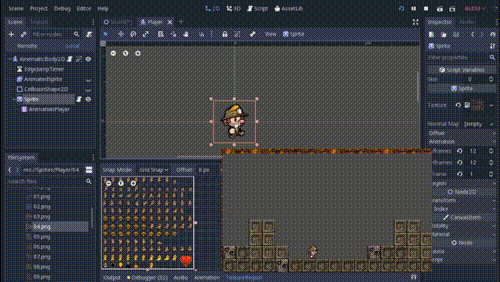

# [Godot] Platformer Player FSM
A Player state machine demo in Godot.

## [:tv: Video sample](http://www.youtube.com/watch?v=L62vRaYsDRw)

## Features
 - Edge jump tolerance (jump button press)
 - Floor anticipation (jump button press)
 - One-way platforms
 - 6 states

## How does it work?
The player finite state machine (aka. PlayerFSM) switches among 6 states:
 - [Air (StateAir)](godot-platformer-state-machine/Scenes/Player/StateAir.gd)
 - [Idle (StateIdle)](godot-platformer-state-machine/Scenes/Player/StateIdle.gd)
 - [Jump (StateJump)](godot-platformer-state-machine/Scenes/Player/StateJump.gd)
 - [Ladder (StateLadder)](godot-platformer-state-machine/Scenes/Player/StateLadder.gd)
 - [Swim (StateSwim)](godot-platformer-state-machine/Scenes/Player/StateSwim.gd)
 - [Walk (StateWalk)](godot-platformer-state-machine/Scenes/Player/StateWalk.gd)

Those states inherit from [BasePlayerState](godot-platformer-state-machine/Scenes/Player/BasePlayerState.gd) and the machine is controlled by [PlayerFSM](godot-platformer-state-machine/Scenes/Player/PlayerFSM.gd).

The player itself ([Player.gd](godot-platformer-state-machine/Scenes/Player/Player.gd)), which is a KinematicBody2D node, runs the PlayerFSM every frame.

# Extra - Skin selector
Through the **tool** keyword, it is possible to change player skin before runtime, within the engine editor:
 - [SkinSelector](godot-platformer-state-machine/Scenes/Player/SkinSelector.gd)

The skins are located in the [skins directory](godot-platformer-state-machine/Sprites/Player).

## [:tv: Video Sample](http://www.youtube.com/watch?v=3_7PjK7vzG4)

